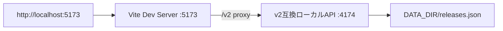
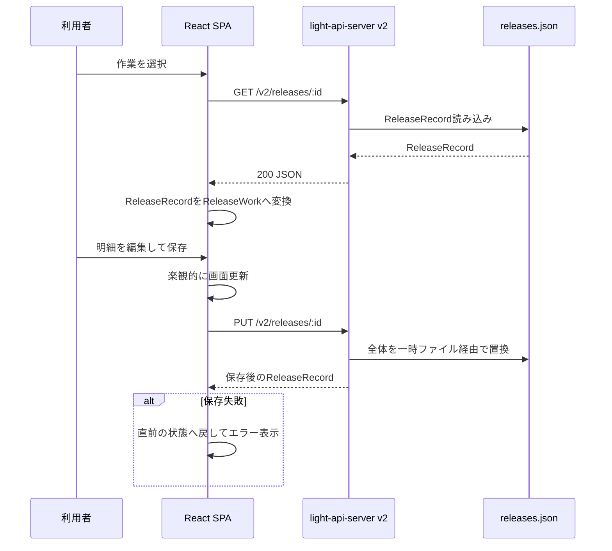
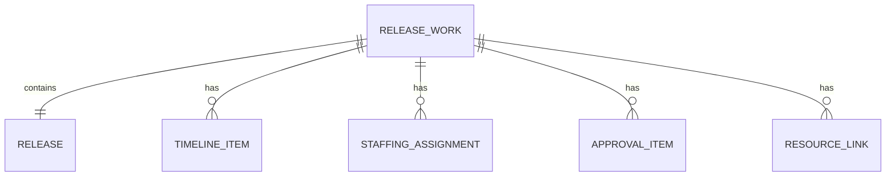

# Release Hub 基本設計書

## 1. 設計方針

- 親のリリース作業と全明細を一つの集約として扱う。
- 通常運用はlight-api-server v2による共有・永続化、GitHub Pagesは操作デモとして分離する。
- 時刻はタイムゾーン変換を行わないローカル日時文字列として扱う。
- 日跨ぎを前提に、開始・終了は日付を含む。
- 共有APIはNode.js標準モジュールだけで構成し、依存パッケージ0を維持する。
- 社内認証はアプリ外のリバースプロキシ／SSOに委譲する。

## 2. システム構成

### 2.1 本番・社内環境

- SPAとAPIは同一Originでも別Originでも配置できる。
- 別Originの場合はAPIをHTTPS化し、light-api-serverのCORSにSPAのOriginを指定する。
- Release Hub固有の処理はSPAのAPIアダプターに置き、共有APIへ専用機能を追加しない。

### 2.2 ローカル開発

- `npm run dev` がViteとNode APIを子プロセスとして同時起動する。
- 片方が終了した場合は、もう一方も終了させる。

### 2.3 GitHub Pagesデモ

- APIと永続ストレージは使用しない。
- 変更はページ再読み込みまで有効である。

## 3. 論理コンポーネント

| コンポーネント | 実装 | 責務 |
| --- | --- | --- |
| エントリポイント | `src/main.tsx` | Reactアプリのマウント |
| アプリケーション | `src/App.tsx` | 画面状態、操作、モーダル、保存制御 |
| APIクライアント | `src/api.ts` | HTTPリクエスト、ReleaseRecord変換、サマリー生成、エラー変換 |
| ドメイン型 | `src/types.ts` | リリース作業と明細のTypeScript型 |
| サンプルデータ | `src/sampleData.ts` | API障害時フォールバック、デモ初期値 |
| スタイル | `src/styles.css` | レイアウト、レスポンシブ、ガント、モーダル |
| ローカル互換サーバー | `server/main.mjs` | v2互換API、静的配信、旧形式移行 |
| 初期データ | `server/seed.json` | 新規データ領域の初期値 |
| 開発ランナー | `scripts/dev.mjs` | ViteとNode APIの同時起動・停止 |

## 4. フロントエンド設計

### 4.1 主要状態

| 状態 | 内容 |
| --- | --- |
| `summaries` | 一覧・カレンダー用の作業サマリー |
| `selected` | 現在表示しているリリース作業全体 |
| `demoWorks` | デモモード用の作業配列 |
| `loading` | 読み込み中状態 |
| `saving` | 保存中状態 |
| `error` | ユーザーへ表示する通信・入力エラー |
| `modal` | 表示中の編集モーダル種別 |
| `editTarget` | 編集対象の作業または明細 |
| `preview` | 申請物／リンクの詳細表示対象 |

### 4.2 データ取得・保存

- 保存は作業全体をPUTする。
- SPAは保存前に画面へ反映し、失敗時は直前の作業へ戻す。
- デモモードではAPI呼び出しをせず、`demoWorks` と `summaries` を更新する。

### 4.3 一覧・カレンダー

- SystemID候補は取得済みサマリーから生成する。
- カレンダーは選択月の先頭週から末尾週までのセルを生成する。
- `releaseDate` の日付部分を使ってイベントを配置する。
- リスト／カレンダーの切替は画面内状態とし、永続化しない。

### 4.4 作業明細日時

- 永続値は `YYYY-MM-DDTHH:mm`。
- 追加フォームでは親の `releaseDate` を `T` 区切りへ変換して予定開始初期値にする。
- 予定終了初期値は開始＋30分。
- 画面入力は作業日、終了日、開始時刻、終了時刻に分割し、送信時に再結合する。
- 所要時間ボタンは開始日時を分へ変換し、指定分を加算して終了日・時刻へ反映する。

### 4.5 ガント計算

- 日時文字列をUTC計算用の分値へ変換するが、意味上はローカルの壁時計時刻として扱う。
- 開始最小値は1時間前へ切り下げ、終了最大値は1時間後へ切り上げる。
- 表示期間に対する割合からバーの `left` と `width` を計算する。
- ドラッグ量をレーン幅と期間から分へ変換し、5分単位へ丸める。
- 移動は期間を維持する。開始・終了ハンドルは反対側と最低5分離す。
- ドラッグ中はローカルのdraft値を表示し、終了時に保存する。

### 4.6 現在時刻ライン

- ローカル年月日時分を分値へ変換する。
- 30秒間隔で再計算する。
- 範囲内ではCSSカスタムプロパティ `--gantt-now-left` を全レーンで共有する。
- 範囲外ではバー位置を描画せず、時間軸右側に案内を表示する。

### 4.7 モーダル

- 背景クリックまたは閉じるボタンで閉じる。
- 新規追加と編集は同じモーダルを使用し、`editTarget` の有無で切り替える。
- 申請物とリンクは、一覧クリック時にまず詳細モーダルを開く。

## 5. データ設計

### 5.1 集約構造

### 5.2 Release

| フィールド | 型 | 必須 | 内容 |
| --- | --- | --- | --- |
| `id` | number | Yes | リリース作業ID |
| `systemId` | string | Yes | 対象システム識別子 |
| `name` | string | Yes | 作業名 |
| `version` | string | No | 対象バージョン。未設定時は空文字 |
| `releaseDate` | string | Yes | 親作業日時。`YYYY-MM-DD HH:mm` |
| `environment` | string | Yes | Production等の環境 |
| `status` | string | Yes | 準備中／進行中／完了 |
| `manager` | string | Yes | 責任者 |
| `updatedBy` | string | Yes | 最終更新者 |
| `updatedAt` | string | Yes | 最終更新日時 |

### 5.3 TimelineItem

| フィールド | 型 | 必須 | 内容 |
| --- | --- | --- | --- |
| `id` | number | Yes | 作業内ID |
| `startAt` | string | Yes | 予定開始 `YYYY-MM-DDTHH:mm` |
| `endAt` | string | Yes | 予定終了 `YYYY-MM-DDTHH:mm` |
| `actualStartAt` | string | No | 実績開始。未入力時は空文字 |
| `actualEndAt` | string | No | 実績終了。未入力時は空文字 |
| `title` | string | Yes | 作業内容 |
| `owner` | string | Yes | 担当者 |
| `status` | enum | Yes | 未着手／進行中／完了 |
| `plan` | enum | Yes | 本線／コンチプラン |

### 5.4 StaffingAssignment

| フィールド | 型 | 必須 | 内容 |
| --- | --- | --- | --- |
| `id` | number | Yes | 体制内ID |
| `name` | string | Yes | 氏名 |
| `phone` | string | No | 電話番号 |
| `startAt` | string | Yes | 対応開始日時 |
| `endAt` | string | Yes | 対応終了日時 |
| `location` | string | Yes | 場所・待機形態 |
| `note` | string | No | 役割・補足 |

### 5.5 ApprovalItem

| フィールド | 型 | 必須 | 内容 |
| --- | --- | --- | --- |
| `id` | number | Yes | 申請物内ID |
| `title` | string | Yes | 申請名 |
| `owner` | string | Yes | 担当者 |
| `due` | string | Yes | 期限（表示用文字列） |
| `status` | enum | Yes | 未申請／申請中／承認済み |
| `url` | string | Yes | 申請先リンク |

### 5.6 ResourceLink

| フィールド | 型 | 必須 | 内容 |
| --- | --- | --- | --- |
| `id` | number | Yes | リンク内ID |
| `title` | string | Yes | タイトル |
| `description` | string | Yes | 説明 |
| `category` | string | Yes | 手順書、監視等の分類 |
| `url` | string | Yes | 遷移先 |

## 6. 共有API・永続化設計

- API詳細は [API仕様書](api-spec.md) を参照する。
- データファイルはlight-api-serverの `DATA_DIR/releases.json`。
- データ形状はトップレベルIDを持つ `ReleaseRecord[]`。
- 書き込みの直列化と一時ファイル経由のrenameはlight-api-serverが担当する。
- `src/api.ts`がReleaseRecordと画面用ReleaseWorkを相互変換し、一覧サマリーを計算する。
- 旧 `release.json` は `npm run migrate:data` でReleaseRecord配列へ変換する。

## 7. 静的ファイル配信

- `/` は `dist/index.html` を返す。
- SPAルートとして拡張子のない未知パスは `index.html` へフォールバックする。
- `index.html` は `no-cache`。
- ハッシュ付き静的資産は1年のimmutableキャッシュ。
- GETとHEADをサポートする。

## 8. エラー設計

| 層 | 方針 |
| --- | --- |
| フォーム | 予定・実績の時系列矛盾を保存前に日本語で表示 |
| APIクライアント | 404は対象なし、それ以外は共有データ処理失敗として表示 |
| React保存 | 楽観更新を取り消し、直前状態へ戻す |
| 共有API | light-api-server v2が4xx、5xxをJSONで返す |
| API障害 | 画面上部にエラーバナーを表示し、初期サンプルを利用可能にする |

## 9. セキュリティ設計

- アプリ内認証は実装しない。外部認証を必須の配置前提とする。
- `updatedBy`は監査証跡ではなく表示用情報として扱う。
- 別Origin配置ではlight-api-serverのCORSに必要なSPA Originだけを明示する。
- iframe埋め込みは同一オリジンだけを許可する。
- 外部リンクは新規タブ＋opener遮断で開く。

## 10. デプロイ設計

### 10.1 Docker

- buildステージで依存導入とViteビルドを行う。
- runtimeステージへ `dist` と `server` のみをコピーする。
- 非rootの `node` ユーザーで実行する。
- `/app/data` を永続ボリュームへ割り当てる。
- 既定ポートは3000。

### 10.2 GitLab CI

- testステージ: 依存導入、型チェック、Nodeテスト。
- buildステージ: production build。
- `dist/`、`server/`、`package.json` を7日間の成果物として保存する。
- 実環境へのデプロイジョブは配置先決定後に追加する。

### 10.3 GitHub Actions / Pages

- `main` pushまたは手動実行で起動する。
- Node 22で `npm test` を実行する。
- `VITE_BASE_PATH=/release-hub/`、`VITE_DEMO_MODE=true` で再ビルドする。
- Pages artifactをuploadし、`github-pages` environmentへdeployする。

## 11. 運用設計

- `/health` をプロセス生存監視に利用する。
- `DATA_DIR/releases.json` をバックアップ対象とする。
- バックアップ・復元はNodeプロセス停止中、または書き込みがない時間帯に行う。
- 水平スケールする場合はJSON永続化から共有DBへの移行が必要である。
- 依存更新時は `npm test` とGitHub Pagesデモを確認する。

## 12. 主要ファイル対応表

| 変更内容 | 同時確認するファイル |
| --- | --- |
| 永続データ項目追加 | `src/types.ts`, `src/sampleData.ts`, `server/seed.json`, `server/main.mjs`, tests, docs |
| UI機能追加 | `src/App.tsx`, `src/styles.css`, tests, README, docs |
| API追加・変更 | `src/api.ts`, `server/main.mjs`, tests, API仕様書 |
| デプロイ変更 | Dockerfile, `.gitlab-ci.yml`, `.github/workflows/pages.yml`, README, 基本設計書 |
