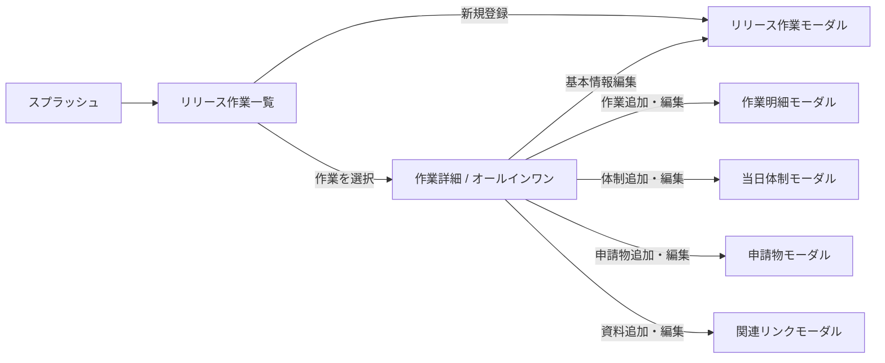

# Release Hub 機能仕様書

## 1. 目的

Release Hub は、リリース作業に必要な予定、当日体制、申請・承認、手順書・関連リンクを一つの作業単位に集約し、準備から当日運用、実績確認までを支援する社内向けWebアプリケーションである。

## 2. 対象範囲

### 2.1 対象

- 親となるリリース作業の登録・編集
- SystemID単位または全体での予定確認
- 月間カレンダーによる作業日の確認
- タイムラインの予定・実績管理
- 本線とコンチプランの区分管理
- 当日体制と連絡先の管理
- 申請物と関連資料の管理
- light-api-server v2を利用した複数利用者間の共有
- GitHub Pagesでの操作デモ

### 2.2 対象外

- アプリケーション内のユーザー認証・権限管理
- GitLab、チケット、監視製品など外部システムとの自動同期
- 変更履歴の世代管理・差分監査
- 通知、メール、チャット送信

## 3. 想定利用者

| 利用者 | 主な利用目的 |
| --- | --- |
| リリース責任者 | 親作業の登録、全体状況と進捗の確認 |
| 作業担当者 | 予定・実績の更新、当日の作業順確認 |
| 当日対応メンバー | 対応時間、役割、電話番号の確認 |
| 承認・運用関係者 | 申請状況、手順書、関連リンクの確認 |
| システム運用者 | light-api-server、証明書、永続領域、デプロイの管理 |

## 4. 用語

| 用語 | 定義 |
| --- | --- |
| リリース作業 | SystemID、作業日時、責任者などを持つ親データ |
| 作業明細 | リリース当日の個々の工程。タイムライン項目とも呼ぶ |
| 本線 | 通常実施する作業計画 |
| コンチプラン | 障害・判断結果などに応じて実施する代替計画 |
| 当日体制 | 作業を支援するメンバーの対応時間、連絡先、場所、役割 |
| 予定 | 作業明細の計画開始・終了日時 |
| 実績 | 作業明細の実際の開始・終了日時 |
| デモモード | GitHub Pages上でサンプルデータをブラウザ内だけで操作するモード |

## 5. 画面構成

## 6. 機能仕様

### 6.1 起動・共通

- ブラウザセッションの初回表示時にスプラッシュ画像を表示する。
- 同一セッション内ではスプラッシュを再表示しない。
- `prefers-reduced-motion` が有効な場合は表示時間を短縮する。
- API通信失敗時はエラーバナーを表示する。
- フロントエンド単独開発時にAPIを取得できない場合はサンプルデータを表示する。
- 画面文言は日本語とし、デスクトップとモバイルの双方で利用できる。

### 6.2 リリース作業一覧

- 全リリース作業をIDの降順で表示する。
- 作業名、バージョン、環境、SystemID、作業日時、責任者、進捗、明細数、状態を表示する。
- SystemIDで絞り込める。未設定の既存データは「未設定」として扱う。
- 作業状態を「すべて」「未完了」「完了」で絞り込める。SystemID条件と同時に適用する。
- 表示形式をリストと月間カレンダーで切り替えられる。
- カレンダーは前月・次月へ移動でき、日付ごとに作業を表示する。
- 一覧またはカレンダーの作業を選択すると作業詳細を開く。

### 6.3 リリース作業登録・編集

- 必須項目はSystemID、作業名、バージョン、作業日時、環境、責任者とする。
- 新規登録時の状態は「準備中」とする。
- 編集時は状態を「準備中」「進行中」「完了」から選択できる。
- 基本情報を編集しても配下の作業明細、当日体制、申請物、関連リンクを保持する。
- 登録完了後は作成した作業の詳細へ遷移する。
- 詳細画面から削除確認モーダルを開ける。
- 確認後に親作業と配下の作業明細、当日体制、申請物、関連リンクを一括削除する。
- 削除操作は取り消せないことを確認モーダルに表示する。

### 6.4 作業詳細・サマリー

- 作業名、SystemID、バージョン、環境、作業日時、責任者、状態を表示する。
- 作業明細数、完了数、当日体制人数、承認済み件数、関連資料数を表示する。
- 進捗率は「完了の作業明細数 ÷ 全作業明細数」を四捨五入して算出する。
- 作業明細が0件の場合の進捗率は0%とする。

### 6.5 オールインワン表示

- 作業明細と当日体制を同じ画面で確認・編集できる。
- 表示形式をリストとガントで切り替えられる。
- リストでは作業明細を本線とコンチプランに分けて表示し、当日体制を続けて表示する。
- ガントでは作業明細と当日体制を共通の時間軸に配置する。

### 6.6 作業明細

- 区分は「本線」「コンチプラン」から選択する。
- 状態は「未着手」「進行中」「完了」から選択する。
- 作業内容、担当者、予定開始日時、予定終了日時を必須とする。
- 実績開始日時と実績終了日時は任意とする。
- 実績終了のみの入力は禁止する。
- 予定・実績とも終了日時は開始日時より後でなければならない。
- 実績開始のみを入力した場合は進行中として表示できる。
- 実績開始・終了には「今を設定」ボタンで現在のローカル日時を入力できる。

#### 作業明細追加時の日時入力

- 親のリリース作業日時から作業日と開始時刻を初期表示する。
- 終了日時の初期値は開始日時の30分後とする。
- 作業日、終了日、開始時刻、終了時刻を分けて入力する。
- 時刻入力は5分単位とする。
- 「＋15分」「＋30分」「＋60分」で開始日時から終了日時を設定できる。
- 所要時間ボタンで日を跨ぐ場合は終了日も翌日に更新する。
- 手入力で日を跨ぐ、または複数日に渡る予定も登録できる。
- 編集時は既存の予定日時を分解して初期表示する。

#### 作業明細の並べ替え

- リスト内で作業明細を上下にドラッグして並べ替えられる。
- 本線とコンチプランのグループ間をドラッグして区分を変更できる。
- 並び順は配列順として保存する。

### 6.7 ガント

- 全作業明細・当日体制の最小開始日時から最大終了日時を基に表示範囲を決定する。
- 表示範囲の前後に時間単位の余白を持たせ、最低2時間を表示する。
- 作業の予定バー、実績バー、当日体制バーを表示する。
- 作業予定バーと当日体制バーは左右ドラッグで5分単位に移動できる。
- バー両端のハンドルで開始・終了日時を5分単位に変更できる。
- 作業実績バーはクリックすると編集モーダルを開く。
- 現在時刻が表示範囲内の場合、時間軸と各レーンに赤い縦線を表示する。
- 現在時刻の表示は30秒ごとに再計算し、ラベルは分単位で表示する。
- 現在時刻が範囲外の場合は時間軸を拡張せず、「表示範囲外」と表示する。

### 6.8 当日体制

- 氏名、電話番号、対応開始日時、対応終了日時、場所・待機形態、役割・補足を管理する。
- 氏名、開始・終了日時、場所・待機形態は必須とする。
- 電話番号、役割・補足は任意とする。
- 終了日時は開始日時より後でなければならない。
- 日跨ぎ・複数日の対応時間を登録できる。
- リストの行をクリックして編集できる。
- ガントでバーの移動と両端の変更ができる。

### 6.9 申請物

- 申請名、担当者、期限、状態、申請リンクを管理する。
- 状態は「未申請」「申請中」「承認済み」から選択する。
- 一覧から詳細モーダルを開き、内容確認後にリンクを開く。
- 詳細モーダルから編集へ移動できる。
- 外部リンクは別タブで開き、`noopener noreferrer` を指定する。

### 6.10 手順書・関連リンク

- タイトル、カテゴリ、説明、URLを管理する。
- 一覧から詳細モーダルを開き、内容確認後にリンクを開く。
- 詳細モーダルから編集へ移動できる。
- 外部リンクは別タブで開き、`noopener noreferrer` を指定する。

### 6.11 デモモード

- `VITE_DEMO_MODE=true` で有効化する。
- Node APIへアクセスせず、サンプルデータをReactのメモリ上で操作する。
- 追加・編集・並べ替えは画面上では反映されるが、再読み込み後は初期状態に戻る。
- GitHub Pagesはデモモードでビルドする。

## 7. 業務ルール

| ID | ルール |
| --- | --- |
| BR-01 | リリース作業はSystemIDを必須とする。既存の欠損データのみ「未設定」で補完する |
| BR-02 | 作業明細と当日体制の終了日時は開始日時より後とする |
| BR-03 | 実績終了日時を登録する場合は実績開始日時も必須とする |
| BR-04 | 進捗率は作業明細の完了状態だけから計算する |
| BR-05 | 子要素のIDはリリース作業内の種別ごとに最大ID＋1で採番する |
| BR-06 | 更新者は認証プロキシヘッダーを優先し、存在しない場合は既存値等を使う |
| BR-07 | リリース作業の更新は配下データを含む作業全体の置換とする |

## 8. 非機能要件

### 8.1 対応環境

- Node.js 20以上を必要とする。
- モダンブラウザを対象とする。
- 本番はSPAとlight-api-serverを同一Originまたは別Originで配信できる。

### 8.2 セキュリティ

- 別Origin配置ではlight-api-serverのCORSにSPA Originを明示する。
- HTTPSは秘密鍵・証明書のファイルパスをAPI設定へ指定する。
- リクエストボディはlight-api-serverの `maxBodyBytes` 設定で制限する。
- 認証・認可は社内リバースプロキシまたはSSOで実施する前提とする。

### 8.3 可用性・整合性

- JSON書き込みはlight-api-serverがリソース単位のプロセス内キューで直列化する。
- light-api-serverが一時ファイルへ書き込み後にrenameして置換する。
- `DATA_DIR` は永続ボリュームへ配置する。
- 複数Nodeプロセスから同一JSONを同時更新する構成は対象外とする。

## 9. 既知の制約

- 作業全体をPUTするため、同じ作業を複数ユーザーが同時編集した場合は後勝ちとなる。
- 削除後の復元機能と監査ログはない。
- 期限は文字列で保持し、日付形式の厳密な検証を行わない。
- URLは文字列として保持し、到達性の検証を行わない。
- GitHub Pagesデモにはサーバー永続化がない。
- 汎用APIはRelease Hub固有のフィールド検証を行わない。入力検証とデータ変換はSPAが担当する。

## 10. 今後の検討事項

- 楽観ロックまたはバージョン番号による同時更新制御
- 削除済み作業の復元
- 操作履歴・監査ログ
- ロール別権限制御
- 通知、外部チケット、監視ダッシュボードとの連携
- 検索条件・カレンダー表示設定の保存
